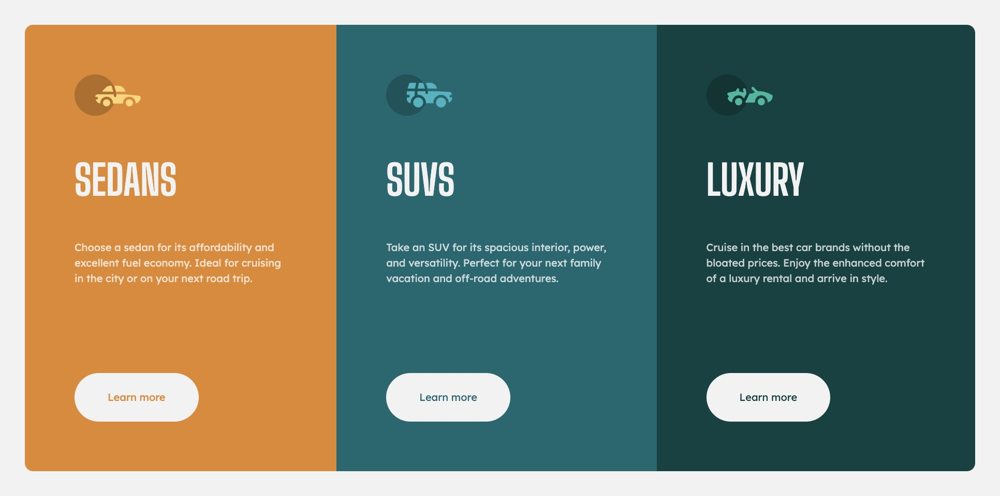
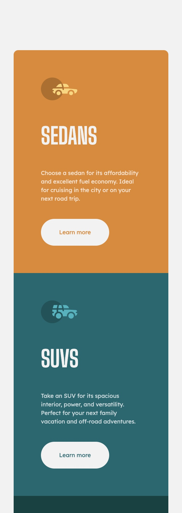

# Frontend Mentor - 3-column preview card component solution

This is a solution to the [3-column preview card component challenge on Frontend Mentor](https://www.frontendmentor.io/challenges/3column-preview-card-component-pH92eAR2-). Frontend Mentor challenges help you improve your coding skills by building realistic projects. 

## Table of contents

- [Overview](#overview)
  - [The challenge](#the-challenge)
  - [Screenshots](#screenshots)
  - [Links](#links)
- [My process](#my-process)
  - [Built with](#built-with)
  - [What I learned](#what-i-learned)
  - [Continued development](#continued-development)
- [Author](#author)

**Note: Delete this note and update the table of contents based on what sections you keep.**

## Overview

### The challenge

Users should be able to:

- View the optimal layout depending on their device's screen size
- See hover states for interactive elements

### Screenshots

### Links

- Solution URL: [https://github.com/webdevbynight/3-column-preview-card-component-main](https://github.com/webdevbynight/3-column-preview-card-component-main)
- Live Site URL: [https://webdevbynight.github.io/3-column-preview-card-component-main/](https://webdevbynight.github.io/3-column-preview-card-component-main/)

## My process

### Built with

- Semantic HTML5 markup
- CSS (via SCSS)
  - custom properties
  - Flexbox
  - pseudo-classes
  - pseudo-elements
  - CSS sprite
- Mobile-first workflow

### What I learned

I put the three icons into a single SVG file used as a CSS sprite, in order to serve the background images and save two HTTP requests.

### Continued development

I still have to learn about how to make front-end development in a more efficient way and to learn to manage to build web pages without seeming to be too slow.

## Author

- Website - [@webdevbynight](https://github.com/webdevbynight)
- Frontend Mentor - [@webdevbynight](https://www.frontendmentor.io/profile/webdevbynight)
